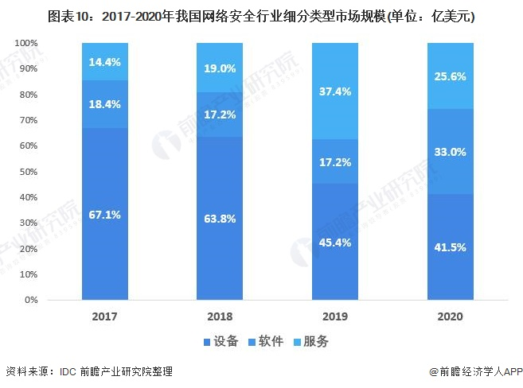

## 一、执行总结

公司概述

产品与服务

市场与竞争分析

4.市场营销

5.投资与财务分析

6.风险分析和退出方式

## 二、公司描述

### 2.1公司简介

### 2.2公司目标

### 2.3公司战略

#### 2.3.1总体战略

#### 2.3.2战略发展

#### 2.3.3战略评估（可行性等）

## 三、产品与服务

### 3.1项目背景

### 3.2产品描述

### 3.3产品独创性与优点

### 3.4产品应用前景

可以在这部分加上你的产品或服务的照片，也可放在附录部分。注意不需要透露你的核心技术，主要介绍你的技术、产品的功能、应用领域、市场前景等。

## 四、市场分析

通过市场调查和分析，描述、分析目标市场顾客，分析、预测市场容量和趋势，估计市场份额和销售额，预测市场发展的走势。可通过图表进行分析，直观、清晰。

### 4.1市场概述
#### 4.1.1网络安全行业概况  
网络安全是指网络系统的硬件、软件及其系统中的数据受到保护，不因偶然的或者恶意的原因而遭受到破坏、更改、泄露，系统连续可靠正常地运行，网络服务不中断。  

当前，信息网络技术的快速发展，网络安全技术产业不断细分发展，产业结构不断变化完善。同时，软硬件产品的界限愈发模糊，产品和服务的联动更加紧密。在借鉴IDC产业分类、PDRR模型和Gartner ASA自适应安全架构等国际主流网络安全产品和服务的分类方式基础上，结合我国实际，依据主要功能及形态、安全防御生命周期可将我国网络安全产品和服务分为如下类别。

#### 4.1.2 网络安全行业产业链剖析  
随着国家对互联网安全、个人隐私安全等相关方面的政策出台，网络安全相关产业也随之强大起来，在保障国家、社会和个人的信息安全发挥重大作用的同时，亦推动了相关产业链的发展。从网络安全产业链看，上游为设备/系统等供应商，如芯片、内存、操作系统、引擎等;中游为网络安全产品和服务厂商，如网络安全设备领域的防火墙/VPN，软件领域的安全性与漏洞管理以及服务领域的运维培训等;下游为应用领域，除个人消费者外，还包含政府、军工、金融等相关领域。  

从具体的相关厂商来看，上游设备/系统提供商有英特尔(INTC)、高通(QCOM)、微软系统(MSFT)、苹果系统(AAPL)、甲骨文(ORCL)等厂商，中游有深信服(300454)、天融信(002212)、奇安信(688561)、启明星辰(002439)等著名厂商，下游包括5G、互联网等细分市场的应用。  
  

#### 4.1.3 中国网络安全行业政策背景

#### 4.1.4 中国网络安全行业市场规模
2013年开始，随着国家在科技专项上的支持加大、用户需求扩大、企业产品逐步成熟和不断创新，网络安全产业依然处在快速成长阶段，近年来，受下游需求及政府政策的推动，我国网络安全企业数量不断增加，网络安全产业规模也不断发展。

IDC、中国信通院、CCIA、CCID的报告分别显示2020年中国网络安全市场规模约为512.85亿元、1702亿元、553亿元、749.2亿元，较2019年增速分别为16.13%、8.82%、15.69%、23.20%。
    

#### 4.1.5 中国网络安全行业市场预测
2021年8月20日，我国发布《中华人民共和国个人信息保护法》，进一步加强个人信息防护，另外，以滴滴上市叫停事件为导火索，国家对于网络安全的重视程度可见一斑。未来，我国网络安全行业的市场规模将进一步扩大，预计到2026年，市场规模将逼近4000亿元大关。

 
### 4.2 市场细分
从细分类型来看，2017-2020年，网络安全设备市场规模维持在30亿美元左右，2020年为32.7亿美元，但规模占比逐年递减，2020年占行业总规模的41.5%，同比降低3.9个百分点;软件和服务市场近几年有明显上升趋势，2020年规模占比分别为33.0%和25.6%。整体来看，网络安全行业市场之间呈“三足鼎立”态势。

### 4.3 目标市场

#### 4.3.1 目标市场选择

#### 4.3.2 目标市场前景分析

  经过几年技术迭代，针对物联网设备网络攻击已经呈现自动化、智能化、多类攻击技术组合等特点，反观目前物联网防御态势处于极端不对称状态，包括：攻防成本不对称、攻防技术不对称。

在业务站点前部署入侵检测、防毒墙、防火墙、态势感知等等安全设备，对进出网流量、行为进行检测、判断和防御，并通过补丁、软件升级减少出现漏洞的地方，这一套在Web2.0时代下行之有效的方法，在物联网安全背景下有点水土不服。

物联网终端设备其中一个特点是小又广，终端可以小如指甲盖，分布广如天上明星，为每一个物联网终端设备配置一套前置安全过滤系统显然是不可能的。为物联网云端服务器配置一套安全过滤系统确实能有效防止云端服务中心被恶意控制，从而保护一部分的物理网设备，更多的局域物联网自治设备仍然面临安全威胁，且能局域物联网管理已经是产品设计的基本要求、市场用户功能诉求，因此目前看来终端防御技术是新场景下，成本、收益、可行性平衡的解决方案，也是接来下安全厂商准备发力的赛道。

终端防护植入软件代码多架构平台代码通用性、低能耗设计、低空间要求、在线\离线情况下防护能力实现等异于传统PC软件的设计要求，明年应会得以实现。

### 4.4 目标顾客

#### 4.4.1 目标顾客属性

#### 4.4.2 目标顾客需求特点

#### 4.4.3 目标顾客购买意向分析

通过市场调查和分析，描述、分析目标市场顾客，分析、预测市场容量和趋势，估计市场份额和销售额，预测市场发展的走势。可通过图表进行分析，直观、清晰。

## 五、竞争分析

### 5.1现有行业竞争者分析

### 5.1.1国内竞争者分析
#### 5.1.1 中国网络安全行业竞争梯队

随着国家网信办工作持续发力，为网络安全技术创新、网络安全企业做大做强提供了宝贵机遇，也为网络安全产业发展创造了更为优越的政策环境，国内网络安全产业进入发展黄金期。目前，我国网络安全竞争梯队分布较为清晰，总体分为三大业务板块。  

在网络安全设备方面，深信服(300454)凭借大比例的市场份额和丰富的产品线处于第一梯队，第二梯队为奇安信(688561)、新华三、绿盟科技(300369)和安恒信息(688023);在网络安全软件方面，阿里巴巴(1688.HK)在WEB领域处于寡头地位，启明星辰(002439)在安全管理平台处于优势地位，奇安信(688561)则在终端安全管理市场处于第一梯队;在网络安全服务方面，国内企业布局较少，外企赛门铁克、IBM处于相对优势地位，我国企业启明星辰(002439)亦有所布局。   

#### 5.1.2中国网络安全行业市场竞争格局分析

  从上市企业地域分布来看，截至2023年4月3日，北京以32家上市成为网络安全厂商上市数量最多的城市，其中奇安信、启明星辰、北信源等龙头厂商均分布于此。其次是广东地区，上市企业数量为25家，其中深信服、天融信等厂商发源于此地。其他城市的网络安全上市厂商数量均在10家以下，其中著名厂商三六零位于天津，中孚信息信息位于山东，山石网科、亚信安全位于江苏，安恒信息及迪普科技位于浙江。    
  
  
    
  

  2022年6月23日，中国网络安全产业联盟(CCIA)发布《2022年中国网络安全市场与企业竞争力分析》报告，统计显示，2022年上半年，4家网络安全头部企业的市占率之和已超过市场总额的四分之一，奇安信、启明星辰、深信服和天融信四家公司市场占有率均达到或超过5%，其中奇安信一家就达到9.5%。
     

#### 5.1.3中国网络安全行业市场集中度
中国网络安全产业联盟(CCIA)统计信息显示，2021年我国网络安全市场CR1为9.5%，CR4为28.07%，CR8为43.96%，整体市场集中度进一步提升。当前。网络安全市场逐步进入稳健增长阶段，头部企业在规模和资源上拥有明显优势，随着时间推移，头部企业拥有的市场份额会逐渐扩大，前瞻预计未来我国网络安全市场集中度将会持续提升，初步统计，2022年，我国网络安全市场CR1为10.40%，CR4为30.93%，CR8为47.76%。

  

#### 5.1.4中国网络安全行业企业布局及竞争力评价情况
网络安全行业的上市公司中，绿盟科技(300369)网络业务布局最广，重点布局在华东、华北地区。其他上市企业业务布局均集中于华东、华北、华南等核心地区。  

从企业网络安全业务的竞争力来看，深信服(300454)、天融信(002212)、奇安信(688561)、启明星辰(002439)等企业的竞争力排名较强;其次是安恒信息(688023)、北信源(300352)等。  

[源自](https://bg.qianzhan.com/trends/detail/506/230713-b1335fbb.html)

### 5.1.2国外竞争者分析

### 5.2替代品竞争分析

### 5.3潜在竞争者分析

#### 5.3.1市场方面

    
  
#### 5.3.2技术方面

  
### 5.4 SWOT 分析

## 六、市场营销

### 6.1 营销策略

### 6.1.1 概述

#### 6.1.2营销理念

#### 6.1.3 营销进度计划

### 6.2 产品策略

### 6.3 价格策略

### 6.4 销售渠道

### 6.5 促销策略

#### 6.5.1 人员推销

#### 6.5.2 广告促销

#### 6.5.3 营业推广

### 6.6 公共关系

### 6.7 服务

#### 6.7.1售前服务

#### 6.7.2售中服务

#### 6.7.3售后服务

## 七、投资分析

### 7.1 股本结构

### 7.2 所需资金及主要来源

### 7.3 投资收益与风险分析

#### 7.3.1主要假设

#### 7.3.2投资现金流量表

### 7.4 各项投资测评系数

#### 7.4.1 投资净现值

#### 7.4.2 投资回收期

#### 7.4.3 内含报酬率

#### 7.4.4 项目敏感性分析

#### 7.4.5 盈亏平衡分析

## 八、财务分析

### 8.1 财务预算假设

### 8.2 相关财务报表

 表一：预计利润表  

表二：计资产负债表  

表三：预计现金流量表  

### 8.3 财务分析

## 九、风险分析和退出方式

### 9.1 技术风险

### 9.2 市场风险

### 9.3 经营风险

### 9.4 财务风险

### 9.5 政策风险

### 9.6 对策

### 9.7 风险资本的退出

### 9.7.1 撤出方式

### 9.7.2 撤出时间

## 十、附录

附录可根据自己项目的实际情况列出。如有以下材料，请列出：

附件一：营业执照  

附件二：发明专利证书  

附件三：其他财务明细核算表  

附件四；公司章程  

附件五：合作意向书  

附件六：调查问卷  
